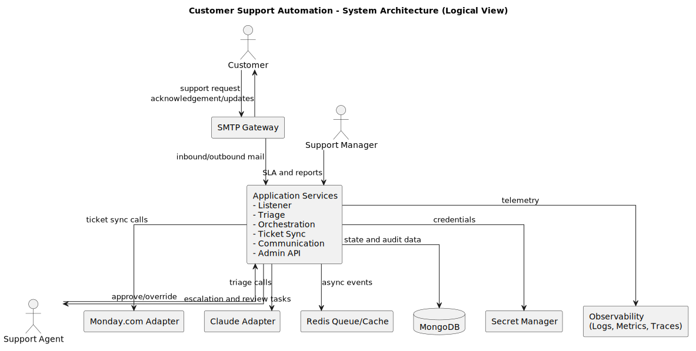
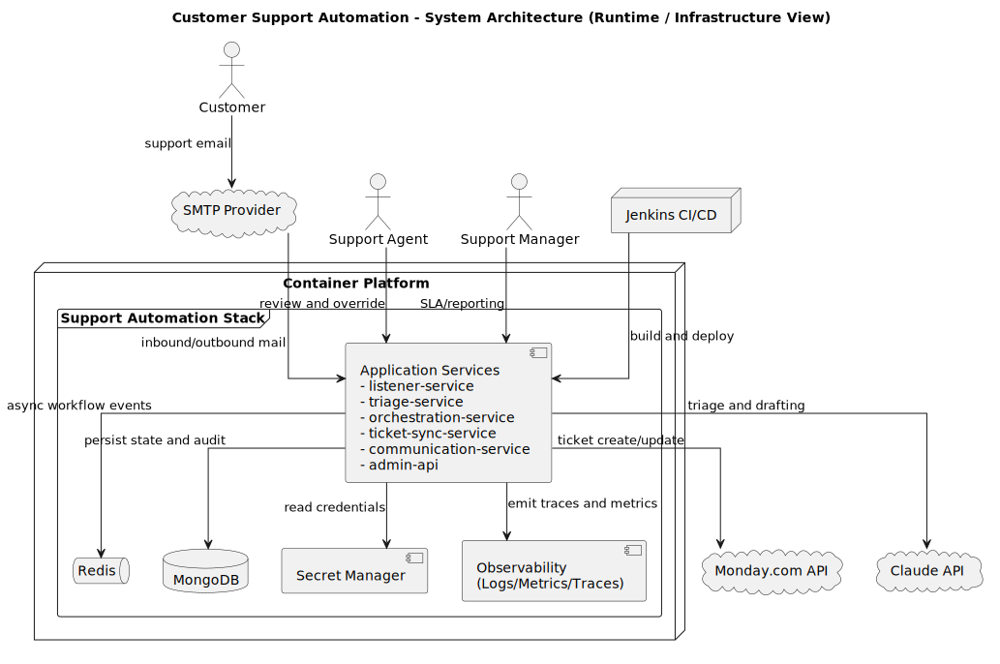
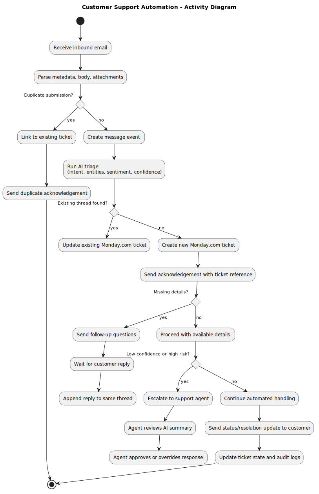
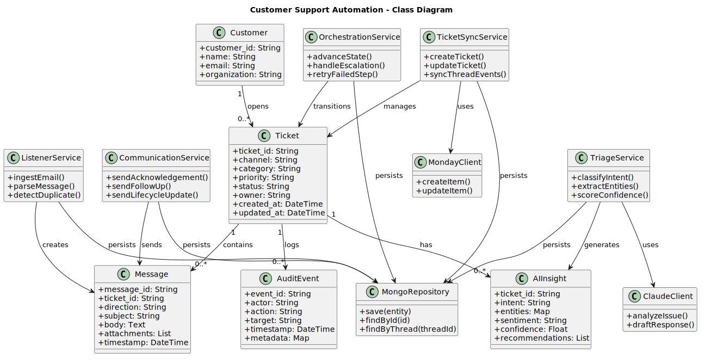
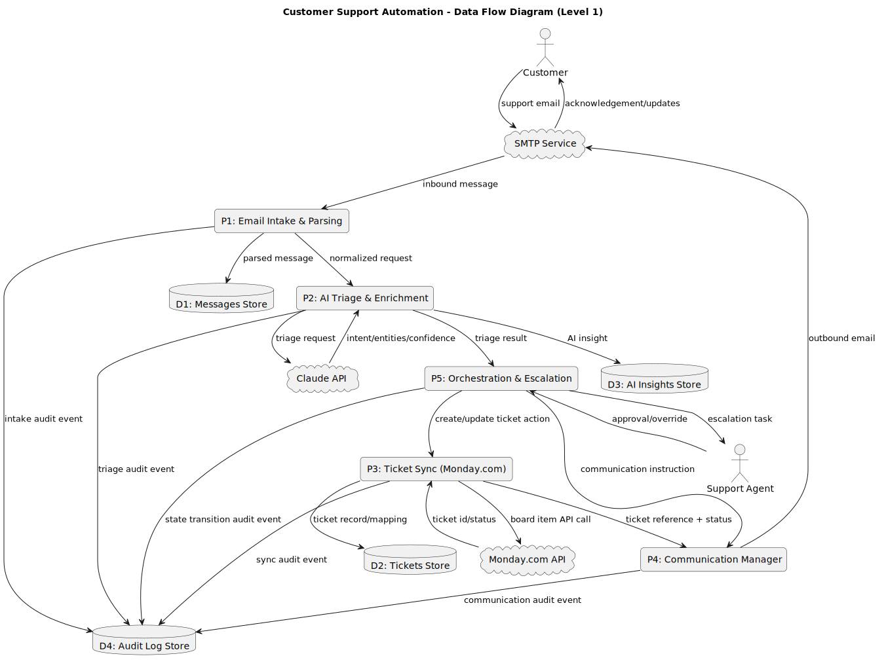
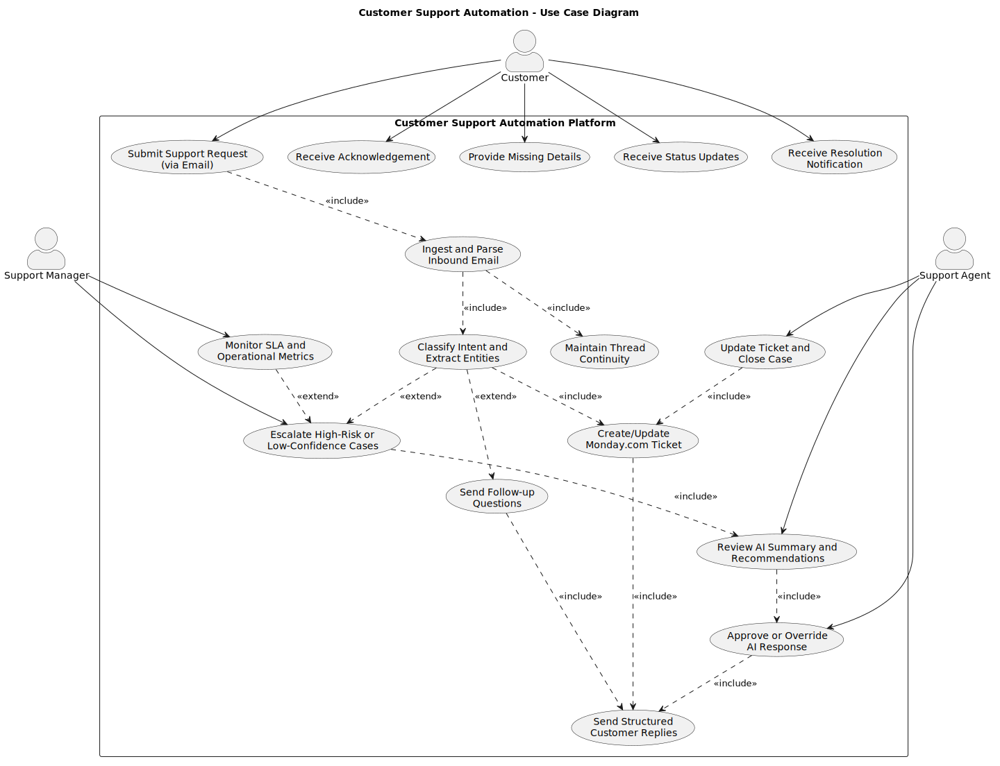
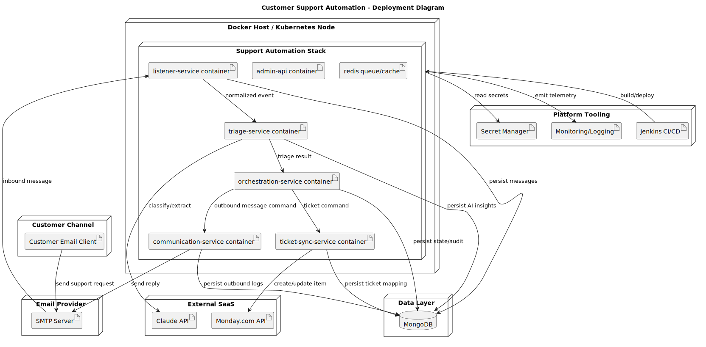

# Customer Support Automation — Technical Overview

**Project:** Customer Support Automation for Tribetron
**Version:** 1.0
**Date:** 2026-03-18
**Status:** Planning / Pre-implementation

---

## Table of Contents

1. [Purpose and Scope](#1-purpose-and-scope)
2. [System Architecture](#2-system-architecture)
   - [Logical View](#21-logical-view)
   - [Runtime / Infrastructure View](#22-runtime--infrastructure-view)
3. [Core Workflow](#3-core-workflow)
4. [Service Breakdown](#4-service-breakdown)
5. [Data Model](#5-data-model)
6. [Integrations](#6-integrations)
7. [AI Triage Pipeline](#7-ai-triage-pipeline)
8. [Class Structure](#8-class-structure)
9. [Data Flow](#9-data-flow)
10. [Use Cases](#10-use-cases)
11. [Deployment Architecture](#11-deployment-architecture)
12. [Non-Functional Requirements](#12-non-functional-requirements)
13. [CI/CD Pipeline](#13-cicd-pipeline)
14. [Security Model](#14-security-model)
15. [Implementation Roadmap](#15-implementation-roadmap)
16. [Technology Stack](#16-technology-stack)

---

## 1. Purpose and Scope

Customer Support Automation is an event-driven intelligent support platform for Tribetron. Customers send email to **support@tribetron.com**; the system automatically ingests those requests, triages them using Claude AI, creates and maintains tickets in Monday.com, and manages structured customer communications with human-in-the-loop escalation for uncertain or high-risk cases.

**Core goals:**

- Monitor inbound support email 24/7 with zero manual intake.
- Send a first acknowledgement within 60 seconds (P95).
- Create and update Monday.com tickets automatically.
- Maintain reply threading so conversations never fragment.
- Assist help desk agents with AI-generated summaries, draft responses, and troubleshooting steps.
- Operate with secure secrets management, fully containerised services, and a Jenkins CI/CD pipeline.

**Out-of-scope (initial phase):** live chat, phone/SMS channels, self-service knowledge base portal.

---

## 2. System Architecture

### 2.1 Logical View

The logical view shows the major components and their communication boundaries, independent of deployment topology.



| Component | Responsibility |
|---|---|
| **SMTP Gateway** | Inbound and outbound email transport |
| **Application Services** | Listener, Triage, Orchestration, Ticket Sync, Communication, Admin API |
| **Claude Adapter** | Abstraction layer over Claude API for triage and response drafting |
| **Monday.com Adapter** | Abstraction layer over Monday.com REST API |
| **Redis Queue / Cache** | Async event bus and short-lived cache |
| **MongoDB** | Persistent state, audit trail, and thread correlation data |
| **Secret Manager** | Runtime credential injection; no secrets in source code |
| **Observability** | Centralised logs, metrics, and distributed traces |

Actors: **Customer** (sends support requests), **Support Agent** (reviews escalations and approves AI responses), **Support Manager** (monitors SLA and operational reports).

---

### 2.2 Runtime / Infrastructure View

The runtime view shows how components are deployed and interconnected at infrastructure level.



All application services run inside a **Container Platform** (Docker / Kubernetes). External dependencies — SMTP provider, Monday.com, and Claude API — are consumed over HTTPS. Jenkins CI/CD builds and deploys container images into the platform. The Secret Manager, Observability stack (logs, metrics, traces), MongoDB, and Redis are co-located within the same deployment boundary.

---

## 3. Core Workflow

The end-to-end lifecycle from email receipt to ticket resolution:



| Step | Description |
|---|---|
| 1 | Customer sends email to support@tribetron.com |
| 2 | **Listener** ingests, parses metadata/body/attachments, checks for duplicates |
| 3 | **Triage** (Claude) classifies intent, extracts entities, scores confidence |
| 4 | **Ticket Sync** creates or updates Monday.com item |
| 5 | **Communication** sends acknowledgement with ticket reference (≤ 60 s) |
| 6 | If details are missing, follow-up questions are sent to the customer |
| 7 | Customer replies are detected and appended to the same thread |
| 8 | Low-confidence or high-risk cases are escalated to a human agent |
| 9 | Agent reviews the AI summary and approves or overrides the response |
| 10 | Status and resolution updates are sent to the customer |
| 11 | Ticket is closed and all events are written to the audit log |

**Ticket lifecycle states:**

```
Received → Triaged → In Progress → Waiting on Customer → Resolved → Closed
```

---

## 4. Service Breakdown

| Service | Key Responsibilities |
|---|---|
| **listener-service** | SMTP polling / webhook ingestion, email parsing, deduplication, normalized event publish |
| **triage-service** | Claude-powered intent classification, entity extraction, confidence scoring, escalation routing |
| **ticket-sync-service** | Monday.com item create/update, field mapping, retry and dead-letter handling, thread-ID correlation |
| **communication-service** | Acknowledgement and lifecycle email templates, outbound sender, thread-safe messaging |
| **orchestration-service** | State machine, event coordination, timeout/SLA alerts, failure compensation and replay |
| **admin-api** | Configuration management, template management, reporting endpoints, secret references |
| **shared** | Config, schemas, logging, error handling, common utilities |

---

## 5. Data Model

Backed by **MongoDB**. All collections are indexed for thread lookup, status filtering, and audit queries.



| Collection | Key Fields |
|---|---|
| `customers` | customer_id, name, email, organization |
| `tickets` | ticket_id, channel, category, priority, status, owner, created_at, updated_at |
| `messages` | message_id, ticket_id, direction, subject, body, attachments, timestamp |
| `ai_insights` | ticket_id, intent, entities, sentiment, confidence, recommendations |
| `audit_events` | event_id, actor, action, target, timestamp, metadata |

**Thread correlation:** each inbound email is assigned a deterministic `thread_id` derived from message headers. All subsequent replies resolve to the same `thread_id`, preventing ticket duplication and conversation fragmentation.

---

## 6. Integrations

### 6.1 SMTP (Email)

- Inbound: SMTP polling or webhook for support@tribetron.com.
- Outbound: acknowledgements, follow-ups, status updates, and resolutions sent via the same SMTP provider.
- TLS enforced for all connections.

### 6.2 Monday.com

- REST API used to create items (new tickets) and update item fields (status, notes, owner, timestamps).
- Correlation table maps internal `thread_id` → Monday item ID.
- Retry policy with exponential back-off; failed operations route to a dead-letter queue (DLQ) for replay.

### 6.3 Claude API (Anthropic)

- Used by **triage-service** for intent classification, entity extraction, sentiment analysis, and response draft generation.
- Prompt and model versions are tracked; evaluation harness measures category precision (target ≥ 85 % in pilot).
- Confidence score drives routing: low-confidence → human escalation gate.

---

## 7. AI Triage Pipeline

```
Inbound Message
      │
      ▼
  Claude API ──► Intent Classification
             ──► Entity Extraction (product, account, error text, urgency)
             ──► Sentiment Analysis
             ──► Confidence Score
             ──► Recommended Next Action
      │
      ▼
  confidence ≥ threshold?
      ├─ YES → Continue automated handling
      └─ NO  → Escalate to Support Agent (human-in-the-loop)
```

Entities extracted per message: product name, account ID, affected module, error text, urgency level, environment details, expected resolution outcome.

---

## 8. Class Structure

The class diagram shows domain entities, service classes, and their relationships.


**Domain entities:** `Customer`, `Ticket`, `Message`, `AIInsight`, `AuditEvent`

**Service classes:** `ListenerService`, `TriageService`, `TicketSyncService`, `CommunicationService`, `OrchestrationService`

**Adapter classes:** `ClaudeClient`, `MondayClient`, `MongoRepository`

Key relationships:
- A `Customer` opens zero-or-more `Tickets`.
- A `Ticket` contains zero-or-more `Messages`, `AIInsights`, and `AuditEvents`.
- `TriageService` uses `ClaudeClient`; `TicketSyncService` uses `MondayClient`.
- All five services persist state through `MongoRepository`.

---

## 9. Data Flow

The Level-1 Data Flow Diagram maps all data stores, external systems, and processing stages.



| Process | Inputs | Outputs |
|---|---|---|
| P1: Email Intake & Parsing | SMTP inbound message | Parsed message → D1, normalized request → P2 |
| P2: AI Triage & Enrichment | Normalized request + Claude API | AI insight → D3, triage result → P5 |
| P3: Ticket Sync (Monday.com) | Ticket action from P5 | Board item create/update, ticket record → D2 |
| P4: Communication Manager | Instructions from P5, ticket ref from P3 | Outbound email via SMTP to Customer |
| P5: Orchestration & Escalation | Triage result from P2 | Commands to P3 and P4, escalation tasks to Agent |

All processes emit audit events to **D4: Audit Log Store**.

---

## 10. Use Cases



| Actor | Use Cases |
|---|---|
| **Customer** | Submit Support Request (email), Receive Acknowledgement, Provide Missing Details, Receive Status Updates, Receive Resolution Notification |
| **Support Agent** | Review AI Summary and Recommendations, Approve or Override AI Response, Update Ticket and Close Case |
| **Support Manager** | Monitor SLA and Operational Metrics, Trigger Escalation |

AI-driven use cases included via `<<include>>`: Ingest and Parse Inbound Email, Classify Intent and Extract Entities, Create/Update Monday.com Ticket, Maintain Thread Continuity, Send Follow-up Questions, Send Structured Customer Replies.

---

## 11. Deployment Architecture



All services are containerised (Docker) and orchestrated on a single Docker host or Kubernetes node. Local integration uses Docker Compose.

```
Customer Email Client
        │ SMTP
        ▼
   SMTP Server
        │ inbound message
        ▼
 ┌─────────────────────────────────────────────────────────┐
 │            Container Platform                           │
 │  ┌─────────────────────────────────────────────────┐   │
 │  │           Support Automation Stack              │   │
 │  │  listener-service                               │   │
 │  │  triage-service         ──────────► Claude API  │   │
 │  │  orchestration-service                          │   │
 │  │  ticket-sync-service    ──────────► Monday.com  │   │
 │  │  communication-service  ──────────► SMTP Server │   │
 │  │  admin-api                                      │   │
 │  │  redis (queue/cache)                            │   │
 │  └─────────────────────────────────────────────────┘   │
 │                       │                                 │
 │                       ▼                                 │
 │                   MongoDB                               │
 │   Secret Manager ◄────┘                                 │
 │   Monitoring/Logging ◄┘                                 │
 └─────────────────────────────────────────────────────────┘
        ▲
  Jenkins CI/CD (build & deploy)
```

---

## 12. Non-Functional Requirements

| Category | Requirement |
|---|---|
| **Availability** | 99.9 % monthly uptime for intake and response services |
| **Acknowledgement latency** | ≤ 60 seconds (P95) |
| **Ticket creation latency** | ≤ 120 seconds (P95) |
| **Throughput** | ≥ 10,000 inbound messages/day (initial phase) |
| **Scalability** | Horizontal scaling via container orchestration |
| **Security** | TLS in transit, encryption at rest, RBAC for admin/agent actions, full audit trail |
| **Compliance** | Data retention and PII masking aligned with legal/privacy policy |
| **Reliability** | Retry policies for all external API calls, DLQ for failed message processing |
| **Maintainability** | Modular services with clear interfaces, structured logs, metrics, distributed traces |

---

## 13. CI/CD Pipeline

**Tooling:** Jenkins

```
┌─────────────────────────────────────────────────────────┐
│                   Jenkins Pipeline                      │
│                                                         │
│  [Lint & Static Analysis]                               │
│          │                                              │
│  [Unit Tests]                                           │
│          │                                              │
│  [Integration Tests]                                    │
│          │                                              │
│  [Security Scan (deps + images)]                        │
│          │                                              │
│  [Docker Image Build]                                   │
│          │                                              │
│  [Deploy to Staging] ── quality gate ──► [Approval]     │
│          │                                              │
│  [Deploy to Production]                                 │
└─────────────────────────────────────────────────────────┘
```

Pipeline enforces quality gates before any deployment proceeds. Images are version-tagged for traceability.

---

## 14. Security Model

| Control | Implementation |
|---|---|
| **Secret management** | All credentials (SMTP, Claude API key, Monday.com token, MongoDB URI) stored in a managed Secret Manager; never hardcoded |
| **Secret rotation** | Rotation policy enforced; pre-commit / CI checks detect hardcoded secrets |
| **RBAC** | Role-based access for admin API, agent actions, and service-to-service calls |
| **Transport security** | TLS enforced for all inbound and outbound connections |
| **Encryption at rest** | MongoDB and backups encrypted at rest |
| **Audit trail** | All automated decisions, state transitions, and outbound communications logged to `audit_events` |
| **PII handling** | PII masking applied for log exports and analytics |
| **AI safety gate** | Low-confidence or high-risk AI responses require human agent approval before delivery |

---

## 15. Implementation Roadmap

The project delivers in four phases gated by validation criteria.

| Phase | Steps | Key Deliverable |
|---|---|---|
| **Phase 1** | Steps 1–6 | Email intake → Monday.com ticket → acknowledgement email (≤ 60 s) |
| **Phase 2** | Steps 7–9 | AI triage, thread continuity, full orchestration state machine |
| **Phase 3** | Steps 10–11 | Observability dashboards, Jenkins CI/CD, Docker hardening |
| **Phase 4** | Steps 12–14 | QA hardening, UAT, production rollout, post-launch optimisation |

**Immediate next actions:**

1. Finalise Monday.com board schema and status taxonomy.
2. Confirm SMTP server details and credentials.
3. Provision MongoDB and define initial collections/indexes.
4. Configure Claude API access and baseline prompts.
5. Scaffold service directories and Jenkins pipeline with lint and test stages.

---

## 16. Technology Stack

| Layer | Technology |
|---|---|
| **Language** | Python |
| **API framework** | FastAPI |
| **AI model** | Claude (Anthropic) |
| **Background jobs** | Celery or RQ |
| **Queue / cache** | Redis |
| **Database** | MongoDB |
| **Containerisation** | Docker, Docker Compose |
| **CI/CD** | Jenkins |
| **Email** | SMTP integration |
| **Ticketing** | Monday.com API |
| **Observability** | Structured logs, metrics, distributed traces |

---

## Related Documents

| Document | Description |
|---|---|
| [README.md](README.md) | Project overview and quick-start guide |
| [SRS.md](SRS.md) | Full Software Requirements Specification |
| [IMPLEMENTATION_PLAN.md](IMPLEMENTATION_PLAN.md) | Step-by-step phased implementation plan |

## Diagrams

| Diagram | File |
|---|---|
| Logical Architecture | [system-architecture-logical.svg](system-architecture-logical.svg) |
| Runtime / Infrastructure | [system-architecture-runtime.svg](system-architecture-runtime.svg) |
| Activity Flow | [activity-diagram.svg](activity-diagram.svg) |
| Class Structure | [class-diagram.svg](class-diagram.svg) |
| Data Flow (Level 1) | [dfd-diagram.svg](dfd-diagram.svg) |
| Use Cases | [use-case-diagram.svg](use-case-diagram.svg) |
| Deployment | [deployment-diagram.svg](deployment-diagram.svg) |
